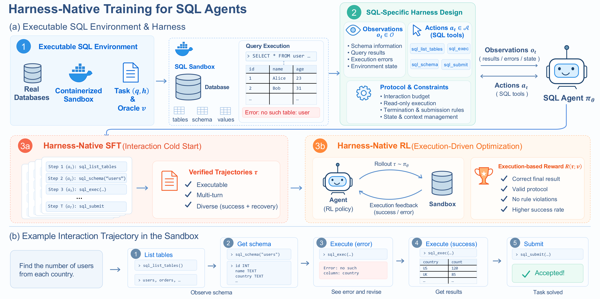

# HarnessSQL

HarnessSQL is an end-to-end research codebase for harness-aware text-to-SQL:

1. convert Spider 2.0-DBT databases from DuckDB to SQLite and build catalogs;
2. synthesize executable SQL tasks from Spider 2.0-Lite SQLite and DBT-derived SQLite;
3. run hosted APIs or local vLLM models through the `dsh-sql` tool harness and retain trajectories;
4. turn verified trajectories into SFT datasets and train Qwen-style causal LMs;
5. run execution-reward RL through Slime with the same SQL task and harness contract.

Generated data, databases, trajectories, model weights, checkpoints, credentials, and machine-specific configuration are intentionally excluded.

## Overview



## Repository map

```text
data_generation/
  data_synthesis/   executable task synthesis and verification
  dbt_sqlite/       Spider 2.0-DBT download and DuckDB-to-SQLite conversion
harness/dsh-sql/    dsh bundle, SQL tools, profile, and benchmark runner
trajectories/       multi-seed dsh-sql rollout and SFT conversion
training/sft/       packed/split dataset assembly and supervised training
training/rl/        production Slime training, model configs, rollout, and reward
configs/            portable training configuration
scripts/            local dsh-sql profile setup
```

## Install

Python 3.10+ and Node.js 22+ are recommended.

```bash
python -m venv .venv
source .venv/bin/activate
pip install -e '.[dev]'

cd harness/dsh-sql
npm ci
python ../../scripts/setup_dsh_profile.py
cd ../..
```

Install the optional training dependencies with `pip install -e '.[sft]'`. RL additionally requires a compatible Slime checkout and its Megatron/SGLang runtime; it is not vendored here.

## 1. Build source databases and tasks

Download the public Spider 2.0-DBT task payloads and convert their DuckDB databases:

```bash
python -m dbt_sqlite.download_harbor_tasks --output-dir artifacts/dbt/tasks
python -m dbt_sqlite.export_sqlite \
  --data-root artifacts/dbt/tasks \
  --output-root artifacts/dbt/sqlite/databases
```

Build catalogs and validate generated blueprints for either database pool:

```bash
python -m data_synthesis.pipeline catalog \
  --database-root /path/to/sqlite/databases \
  --metadata-root /path/to/sqlite/metadata \
  --catalog-dir artifacts/catalogs

export OPENAI_API_KEY=...
python -m data_synthesis.question_generation \
  --databases california_schools,card_games \
  --count 500 \
  --difficulty-mix foundation=.1,core=.3,growth=.35,stretch=.25 \
  --database-root /path/to/sqlite/databases \
  --catalog-dir artifacts/catalogs \
  --output-dir artifacts/blueprints \
  --workers 8 \
  --backend openai-compatible --base-url https://your-endpoint.example/v1 --model your-model

python -m data_synthesis.pipeline pilot \
  --blueprints-file artifacts/blueprints/blueprints.jsonl \
  --database-root /path/to/sqlite/databases \
  --catalog-dir artifacts/catalogs \
  --output-dir artifacts/validated
```

`--count` controls the total number of query tasks. `--difficulty-mix` controls the
proportion of `foundation`, `core`, `growth`, and `stretch` tasks; the mix may be
changed for each run. `--databases`, `--generation-profile`, structural-score
bounds, retry counts, temperature, and worker count are also configurable. API
credentials are read only from environment variables. Local vLLM uses the same
OpenAI-compatible backend with a loopback base URL.

## 2. Collect dsh-sql trajectories

Start vLLM, then collect a configurable number of seeds per task:

```bash
MODEL_PATH=/path/to/model VLLM_PORT=8000 \
  bash harness/dsh-sql/runner/serve_vllm.sh

python trajectories/collect_dsh_trajectories.py \
  --task-file /path/to/tasks.json \
  --db-dir /path/to/sqlite/databases \
  --dsh-root harness/dsh-sql \
  --out-dir artifacts/trajectories \
  --ports 8000 --num-votes 3 --concurrency 16
```

For a hosted endpoint, set `DSH_SQL_GATEWAY_BASE_URL` and `DSH_SQL_GATEWAY_KEY`, then use the Spider runner's `--provider gateway`. The dsh bundle exposes only `sql_list_tables`, `sql_schema`, `sql_exec`, and `sql_submit`; shell, filesystem, web, subagent, and telemetry rows are disabled.

Convert completed dsh session logs to packed and per-turn SFT JSON:

```bash
python trajectories/build_sft_from_dsh.py \
  --sessions 'artifacts/trajectories/seeds/*/homes/*/sessions/*/*/session.jsonl*' \
  --output-dir artifacts/sft
```

## 3. SFT

```bash
MODEL_PATH=/path/to/base-model \
DATA_PATH=artifacts/sft/train.packed.json \
OUTPUT_DIR=artifacts/checkpoints/sft \
DEEPSPEED_CONFIG=configs/deepspeed_zero3.json \
torchrun --nproc-per-node 8 training/sft/train_sft_clean.py
```

The trainer supports `MAX_LENGTH`, `CE_CHUNK`, `USE_LIGER`, `NUM_EPOCHS`, `LR`, `GRAD_ACCUM`, and related environment variables. No model or dataset path has a machine-specific default.

## 4. RL

The complete training entrypoint is the portable version of the production
Slime/Megatron/SGLang job. It includes the GRPO, DAPO, and GSPO profiles,
Qwen3-8B/14B Megatron model configs, dsh-sql rollout generation, binary SQL
execution reward, dynamic sampling filters, optimizer settings, and optional
held-out evaluation.

Prepare both task pools by setting the `HARNESS_SQL_*` variables from
`.env.example`, then run:

```bash
python training/rl/scripts/replay_all_oracles.py --output-dir artifacts/oracle-replay
python training/rl/scripts/build_merged_rl_data.py \
  --out artifacts/rl/text2sql.jsonl \
  --holdout-spider2 70 --holdout-dbt 30
```

Launch training directly:

```bash
SLIME_ROOT=/path/to/slime \
HF_CHECKPOINT=/path/to/qwen3-sft-hf \
REF_LOAD=/path/to/qwen3-sft-torch-dist \
SAVE_DIR=artifacts/checkpoints/rl \
PROMPT_DATA=artifacts/rl/text2sql.jsonl \
MODEL_SIZE=qwen3_8b \
ALGORITHM=dapo \
EVAL_INTERVAL=25 \
EVAL_DATA=artifacts/rl/text2sql.eval.jsonl \
bash training/rl/launch_ray.sh
```

`launch_ray.sh` starts the single-node Ray runtime and submits
`train_rl_dsh.sh`, the actual Slime training command. On Slurm, export the same variables and submit
`training/rl/slurm/train_rl_dsh.sbatch`. Set `EVAL_INTERVAL` and `EVAL_DATA` to
enable held-out validation. `text2sql.generate` launches one isolated harness
subprocess per sample, preserves sampled token IDs/logprobs through an in-process
OpenAI adapter, extracts final SQL, and computes binary execution reward against
hidden result hashes.

See [docs/rl.md](docs/rl.md) for the algorithm profiles and runtime contract.
